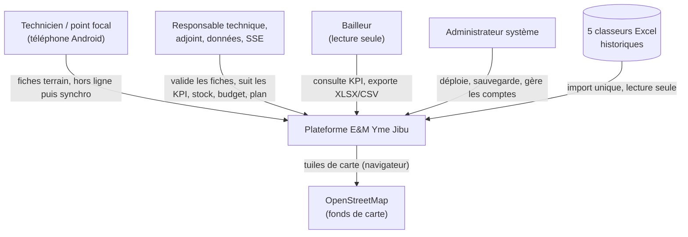
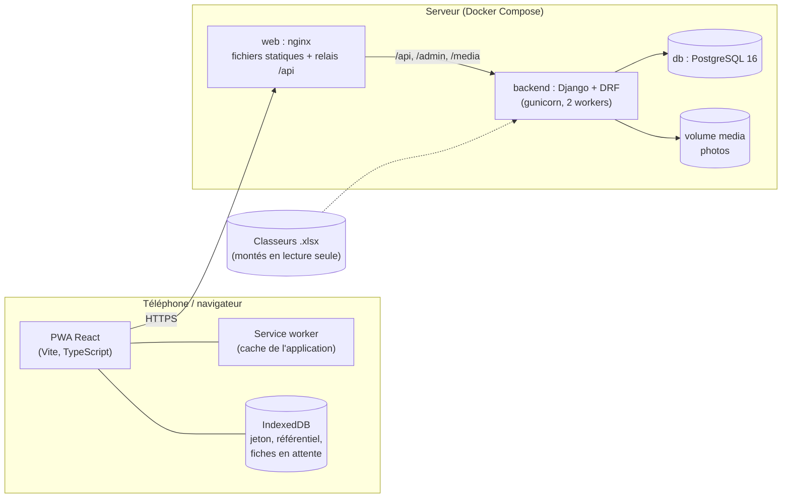
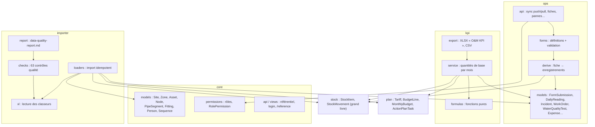
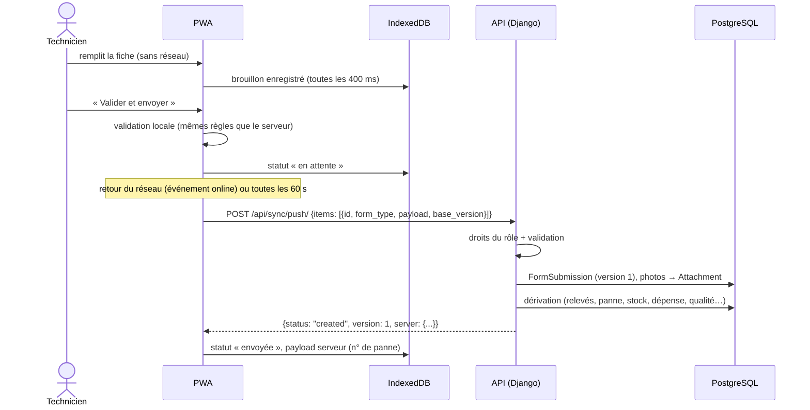
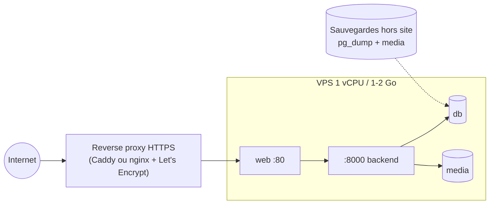

# Architecture

Document d'architecture de la plateforme E&M Yme Jibu, structuré selon le modèle **arc42**, avec des diagrammes **C4** (contexte, conteneurs, composants). Les décisions structurantes sont détaillées dans les [ADR](adr/README.md).

| | |
|---|---|
| Version | 0.1.0 (branche `feat/em-platform`) |
| Responsable | Responsable technique Yme Jibu |
| Dernière révision | 2026-09-27 |

---

## 1. Introduction et objectifs

### 1.1 Problème

L'exploitation et la maintenance (E&M) du réseau d'eau potable **Goma Ouest** (lac Kivu → station Bosco Lac → réservoirs Nyabyunyu → réseau PEHD → 10 bornes fontaines) étaient suivies dans 5 classeurs Excel : fiches papier recopiées dans des feuilles « un bloc de colonnes par jour », puis des formules par référence de cellule pour les KPI. L'audit (voir [data-quality-report.md](data-quality-report.md)) a montré que la plupart des KPI étaient faux (formules erronées, données de test, volumes non reliés).

### 1.2 Exigences principales

| # | Exigence |
|---|---|
| E1 | Saisir les 7 fiches terrain sur téléphone Android, **une journée entière sans réseau** |
| E2 | Calculer les KPI d'E&M à partir des enregistrements, par mois, par actif et par zone |
| E3 | Relier stock, dépenses et budget aux interventions |
| E4 | Tableau de bord pour les responsables et les bailleurs, export au format existant « O&M KPI » |
| E5 | Migrer les données Excel en signalant chaque anomalie, sans modifier les fichiers |
| E6 | Pouvoir ajouter d'autres réseaux que Goma Ouest |

### 1.3 Objectifs de qualité (par priorité)

| Priorité | Qualité | Scénario mesurable |
|---|---|---|
| 1 | **Justesse des KPI** | Chaque formule a un test calculé à la main ; chaque défaut Excel a un test de non-régression |
| 2 | **Fonctionnement hors ligne** | Une fiche saisie sans réseau, application rechargée, puis synchronisée : aucune perte, aucun doublon (test E2E) |
| 3 | **Traçabilité** | Toute valeur importée garde `fichier!feuille!cellule` ; toute fiche brute est conservée telle que saisie |
| 4 | **Sobriété** | Fonctionne sur un petit VPS (1 vCPU, 1 Go) et en 3G ; application terrain < 100 ko gzip hors carte |
| 5 | **Maintenabilité** | Une équipe réduite peut ajouter un champ de formulaire en modifiant un seul fichier |

### 1.4 Parties prenantes

| Rôle | Attentes |
|---|---|
| Techniciens de zone, points focaux pompage/stockage | Fiches simples, gros boutons, fonctionnent sans réseau, ne perdent rien |
| Responsable technique, adjoint, responsable données | Validation des fiches, KPI fiables, stock, budget, plan |
| Responsable SSE | Pannes, qualité de l'eau |
| Bailleurs | KPI et exports en lecture seule |
| Développeurs / administrateur système | Code lisible, déploiement reproductible, documentation à jour |

## 2. Contraintes

| Type | Contrainte |
|---|---|
| Technique | Téléphones Android d'entrée de gamme, écran ~5 pouces, soleil ; réseau mobile intermittent et lent à Goma |
| Technique | Hébergement à faible coût ; pas de dépendance à un service cloud payant |
| Organisationnelle | Équipe francophone : interface et documentation en français ; code en anglais |
| Organisationnelle | Les classeurs Excel restent la référence historique : lecture seule, jamais modifiés |
| Conventions | Pile par défaut : Django + DRF + PostgreSQL, React PWA, Docker Compose ([ADR 0001](adr/0001-stack.md)) |

## 3. Contexte (C4 — niveau 1)

| Interface | Direction | Format |
|---|---|---|
| Application terrain ↔ API | bidirectionnelle | JSON sur HTTPS ; fiches en lot (`/api/sync/push/`) |
| Tableau de bord ↔ API | lecture (+ validation) | JSON ; exports XLSX/CSV |
| Classeurs Excel → base | entrée | `.xlsx` lus par openpyxl (commande `import_excel`) |
| Navigateur → OpenStreetMap | sortie | tuiles PNG (tableau de bord seulement) |

## 4. Stratégie de solution

| Objectif | Approche |
|---|---|
| Hors ligne | PWA (service worker Workbox) + IndexedDB ; file d'attente d'envoi ; identifiants UUID créés sur le téléphone ; versions pour détecter les conflits ([ADR 0002](adr/0002-offline-sync.md)) |
| Justesse des KPI | Fiche brute → enregistrements dérivés → quantités de base par mois → ratios recalculés ; formules pures testées ([ADR 0003](adr/0003-kpi-history.md)) |
| Une seule définition des formulaires | `shared/forms.fr.json` lu par le téléphone (affichage, validation) et par le serveur (validation) |
| Traçabilité | `source_ref` et `flags` sur chaque ligne importée ; `FormSubmission.payload` conservé |
| Sécurité | Jeton par utilisateur, rôles vérifiés côté serveur, données limitées au site ([ADR 0004](adr/0004-securite-roles.md)) |
| Multi-site | Tout est rattaché à un `Site` ; codes préfixés (GO-, GE-…) |

## 5. Vue des conteneurs (C4 — niveau 2)

| Conteneur | Technologie | Responsabilité |
|---|---|---|
| PWA | React 19, TypeScript, Vite, vite-plugin-pwa, idb, Leaflet (chargé à la demande) | Fiches terrain hors ligne, tableau de bord |
| web | nginx | Sert l'application compilée, relaie l'API, ne met jamais `sw.js` en cache |
| backend | Python 3.11, Django 5.1, DRF, drf-spectacular, openpyxl, gunicorn, whitenoise | API, dérivation, KPI, import, administration |
| db | PostgreSQL 16 | Toutes les données |
| media | volume Docker | Photos des pannes |

## 6. Vue des composants (C4 — niveau 3)

### 6.1 Backend

| Composant | Fichier(s) | Rôle |
|---|---|---|
| Définitions des formulaires | `shared/forms.fr.json`, `scripts/build_forms.py` | Source unique des 7 fiches |
| Validation | `backend/ops/forms.py` | Contrôles serveur (obligatoire, plages, listes, existence des actifs/nœuds) |
| Dérivation | `backend/ops/derive.py` | Idempotente ; relevés journaliers partagés recalculés à partir de toutes les fiches actives du jour |
| Synchronisation | `backend/ops/api.py` (`push_one`, `sync_push`, `sync_pull`) | Création / mise à jour / conflit / renvoi, photos |
| Moteur KPI | `backend/kpi/service.py`, `backend/kpi/formulas.py` | Voir [reference/kpi.md](reference/kpi.md) |
| Import | `backend/importer/` | Voir [guides/migration-excel.md](guides/migration-excel.md) |

### 6.2 Frontend

| Module | Fichier(s) | Rôle |
|---|---|---|
| Accès API | `src/lib/api.ts` | Jeton, erreurs, référentiel avec ETag, téléchargements |
| Stockage local | `src/lib/db.ts` | IndexedDB : `kv` (jeton, profil, référentiel) et `outbox` (fiches) |
| Synchronisation | `src/lib/sync.ts` | Envoi par lots de 10, statuts, résolution de conflit, envoi automatique |
| Formulaires | `src/forms/`, `src/lib/forms.ts` | Rendu piloté par définitions, validation, conformité qualité, compression photo |
| Pages terrain | `src/pages/` | Connexion, accueil, fiche |
| Tableau de bord | `src/dashboard/` (chargé à la demande) | KPI, carte, fiches à valider, stock, budget, plan |

## 7. Vue d'exécution

### 7.1 Envoi d'une fiche saisie hors ligne

### 7.2 Conflit

Deux copies de la même fiche sont modifiées (deux téléphones, ou le bureau pendant que le téléphone est hors ligne). Le téléphone envoie `base_version: 1`, le serveur est en version 2 avec un contenu différent : la réponse est `conflict` avec la copie serveur. La fiche affiche les parties différentes et deux choix : **garder ma version** (renvoi avec `base_version: 2`) ou **prendre celle du serveur**. Un contenu identique (réponse perdue puis renvoi) donne `unchanged`, jamais un faux conflit.

### 7.3 Calcul des KPI

`GET /api/kpi/?year=2026` → `compute_year()` : agrégations SQL par mois (`ExtractMonth`) sur les enregistrements → remplacement par l'historique Excel `ACTUAL` pour les mois antérieurs à l'application → ratios recalculés → mois futurs vidés.

## 8. Déploiement

- Local : `docker compose up --build` → <http://localhost:8080>.
- Production : voir [guides/deploiement.md](guides/deploiement.md) (HTTPS obligatoire : service worker, GPS et appareil photo l'exigent).
- Sauvegarde : [guides/sauvegarde-restauration.md](guides/sauvegarde-restauration.md).

## 9. Concepts transverses

| Concept | Mise en œuvre |
|---|---|
| Authentification | Jeton DRF (`Authorization: Token …`) pour l'application ; session Django pour `/admin/` |
| Autorisation | `RolePermission` : `read_roles` / `write_roles` par vue ; rôles autorisés par formulaire ; un agent ne modifie que ses fiches ; données filtrées par site. Voir [reference/roles.md](reference/roles.md) |
| Identifiants | Codes lisibles et stables préfixés par le site ; nœuds en texte ; UUID pour les fiches ; numéros de panne par compteur verrouillé, jamais réutilisés |
| Hors ligne | App shell en cache (service worker), référentiel et fiches en IndexedDB, envoi idempotent |
| Audit | Fiche brute conservée ; enregistrements dérivés liés à leur fiche ; `source_ref` pour l'import ; validation / rejet par un responsable |
| Données manquantes | Jamais remplacées par 0 : `null` jusqu'à l'affichage (« pas de donnée ») |
| Temps | Fuseau `Africa/Lubumbashi` (UTC+2) ; dates de fiches sans fuseau ; horodatages en UTC en base |
| Langue | Interface, libellés et documentation en français ; code, noms de tables et API en anglais |
| Performance | Référentiel avec ETag, gzip, photos compressées (≈150 ko), tableau de bord et carte chargés à la demande |
| Accessibilité | Cibles tactiles ≥ 48 px, contraste élevé, mode sombre, graphiques avec tableau équivalent et navigation clavier |
| Documentation de référence | Générée depuis le code (`python manage.py gen_docs`), vérifiée en CI |

## 10. Décisions d'architecture

Voir l'[index des ADR](adr/README.md).

## 11. Qualité et tests

| Niveau | Outil | Contenu |
|---|---|---|
| Unitaires | pytest | Formules KPI calculées à la main (`test_formulas.py`) |
| Intégration | pytest + PostgreSQL | Service KPI, synchronisation, dérivation, rôles, import réel, export (`backend/tests/`) |
| Non-régression Excel | pytest | Un test par défaut Excel qui faussait un KPI (`test_excel_defects.py`) |
| Bout en bout | Playwright (Chromium, Pixel 5) | Fiches hors ligne → reconnexion → KPI d'août (`frontend/e2e/offline.spec.ts`) |

Stratégie détaillée : [tests.md](tests.md).

## 12. Risques et dette technique

| # | Risque / dette | Impact | Mesure proposée |
|---|---|---|---|
| R1 | Historique janvier–juin peut-être fictif (motifs réguliers) | KPI historiques trompeurs | Confirmer ; sinon `import_excel --history-status provisional` |
| R2 | Jetons d'API sans expiration | Téléphone perdu = accès ouvert | Révoquer le jeton dans `/admin/` ; ajouter une expiration (dette) |
| R3 | Fiches en attente non chiffrées sur le téléphone | Données lisibles si téléphone volé | Code de verrouillage obligatoire sur les téléphones |
| R4 | Photos servies par Django | Charge à grande échelle | Servir `/media/` par nginx ou un stockage objet |
| R5 | Pas de supervision ni d'alerte | Panne serveur non détectée | Surveiller `/api/health/` (voir [guides/exploitation.md](guides/exploitation.md)) |
| R6 | Cibles de KPI codées dans le frontend | Changement = redéploiement | Les déplacer en base (dette) |
| R7 | Pas de limitation des tentatives de connexion | Attaque par force brute | Limiter au niveau du reverse proxy |
| R8 | Carte dépendante d'OpenStreetMap en ligne | Carte vide hors réseau | Acceptable (tableau de bord au bureau) |
| R9 | `docker compose up` non exécuté dans l'environnement de construction | Écart possible avec le natif | Vérifié en natif (PostgreSQL + gunicorn + nginx) ; à valider sur la machine cible |
| R10 | Définitions de formulaires non versionnées par fiche | Un champ renommé casse l'affichage des anciennes fiches | Ne jamais renommer une clé ; en ajouter une nouvelle ([guide](guides/modifier-un-formulaire.md)) |

## 13. Glossaire

| Terme | Définition |
|---|---|
| **E&M** | Exploitation et maintenance |
| **BF** | Borne fontaine (kiosque public, 2 ou 3 robinets) |
| **CP** | Connexion privée |
| **Nœud** | Point du réseau (chambre de vannes, jonction), identifié par un code texte (`1.10`) |
| **NRW** | *Non-revenue water* : eau non facturée = eau introduite − eau facturée |
| **Rendement du réseau** | Eau facturée / eau introduite |
| **Disponibilité** | (Heures du mois − heures d'arrêt) / heures du mois |
| **MU / MC / MP** | Maintenance urgente / corrective / préventive |
| **Fiche** (`FormSubmission`) | Formulaire saisi sur le téléphone, conservé tel quel |
| **Dérivation** | Transformation d'une fiche en enregistrements normalisés utilisés par les KPI |
| **Historique ACTUAL / PROVISIONAL** | Totaux mensuels Excel utilisés / seulement affichés |
| **Outbox** | File d'attente des fiches sur le téléphone |
| **PWA** | *Progressive Web App* : site web installable qui fonctionne hors ligne |
| **ETag** | Empreinte d'une réponse permettant d'éviter un téléchargement inchangé |
