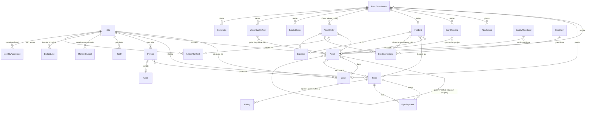
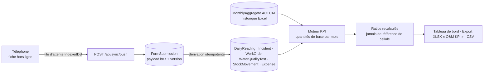

# Modèle de données

PostgreSQL, via Django. Quatre groupes : **référentiel** (`core`), **exploitation** (`ops`), **stock** (`stock`), **planification** (`plan`), plus l'historique mensuel (`kpi`).

Principes :

- **Identifiants stables et lisibles** : actifs `GO-PMP-001`, `GO-RES-001`, `GO-BF-01`… ; nœuds en **texte** (`"1.10"` ≠ `"1.1"`) ; articles `GO-ART-001` ; pannes `GO-INC-2026-0001`. Le préfixe est le code du site : un deuxième réseau (ex. `GE`) cohabite sans collision.
- **Traçabilité** : chaque ligne importée garde `source_ref` (`fichier!feuille!cellule`) et `flags` (codes du rapport qualité).
- **Fiche brute + enregistrements dérivés** : ce que le technicien a saisi est conservé tel quel (`FormSubmission.payload`) ; les enregistrements normalisés (relevés, pannes, ordres de travail, tests qualité, mouvements de stock, dépenses) en sont **dérivés** de façon idempotente. Les KPI ne lisent que les enregistrements dérivés.
- **Stock = grand livre** : le solde est la somme des mouvements, jamais un nombre tapé.
- **Dépense réelle = une seule source** (`Expense`) : alimentée par le coût des pannes (et des ordres de travail), ou saisie au bureau.

## Diagramme entité-relation

## Tables

| Table | Rôle | Clé naturelle | Notes |
|---|---|---|---|
| `Site` | Réseau exploité | `code` (GO) | Multi-site dès l'origine |
| `Zone` | Zone de réseau (point focal) | site + `code` (Z1) | |
| `Asset` | Tout équipement | `code` (GO-PMP-001) | `type`, `parent`, GPS, capacité + unité séparées, `attributes` JSON (robinets, bénéficiaires, DN de raccordement…) |
| `Node` | Nœud du réseau | site + `code` texte | `kind` : jonction, source, station, sortie réservoir, exutoire, point de livraison |
| `PipeSegment` | Tronçon | site + `code` (`1.8>1.10#DN160`) | Un tronçon par DN ; rôle principal / trop-plein / branchement |
| `Fitting` | Organes par nœud | nœud + description | Quantités du registre des organes |
| `Person`, `StaffingNeed` | Personnel, besoins | `source_ref` | Rôle = droits dans l'application |
| `Sequence` | Compteurs (numéros de panne) | site + nom | Incrémenté sous verrou ; jamais réutilisé |
| `FormSubmission` | Fiche saisie (7 types) | UUID généré par le téléphone | `version` pour détecter les conflits ; `status` soumis / validé / rejeté ; `derived_keys` = relevés alimentés ; `assigned_number` = n° de panne attribué |
| `DailyReading` | Relevé journalier | actif + date (unique) | Pompe : heures, débit, pression, volume ; station : kWh, carburant, chlore ; réservoir : volumes entrant/sortant ; BF : volume vendu |
| `Incident` | Panne | `number` | Gravité, cause (11), cause de perte d'eau (13), cause et durée d'arrêt, coût, statut |
| `WorkOrder` | Ordre de travail | — | Préventif/correctif ; planifié → réalisé ; catégorie Captage/Pompage/Réservoir/Réseau/BF ; `origin` : plan, bureau ou créé par une checklist |
| `SafetyCheck` | Point de contrôle | — | Chaque ligne des checklists |
| `WaterQualityTest`, `QualityThreshold` | Qualité de l'eau | — | Conformité calculée depuis le seuil le plus spécifique (actif > type d'actif > site) |
| `Complaint` | Plainte communautaire | — | |
| `Expense` | Dépense réelle | — | Par type de maintenance |
| `StockItem`, `StockMovement` | Stock | `code`, — | Mouvements : stock initial, entrée, sortie, ajustement |
| `Tariff` | Prix électricité / carburant | site + type + date | Le KPI utilise le tarif valable au 1er du mois |
| `MonthlyBudget`, `BudgetLine` | Budget | site + mois | |
| `ActionPlanTask` | Plan annuel | `source_ref` | Jours programmés, avancement ; `plan_work_orders` en génère les ordres de travail |
| `MonthlyAggregate` | Historique mensuel Excel | site + mois + indicateur | `ACTUAL` (utilisé) ou `PROVISIONAL` (affiché seulement) |

## Du formulaire au KPI

Voir `backend/kpi/service.py` (quantités de base) et `backend/kpi/formulas.py` (formules pures).

Détail colonne par colonne (généré) : [reference/dictionnaire-donnees.md](reference/dictionnaire-donnees.md).
